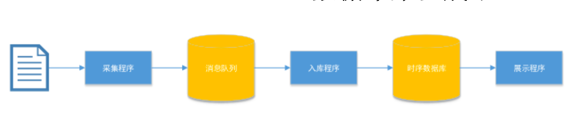

# LOGCOLLECTER

## 安装

1. 安装和配置 mq

2. 安装和配置 opentsdb

3. 安装和配置程序运行环境

```
pip install -r requirements.txt
```

## 运行

程序同时拥有生产者和消费者的角色，生产者负责日志的收集以及队列的写入，消费者负责队列数据的接收，以及日志数据的入库操作。

* 启动生产者程序：`python app.py --role=publisher`
* 启动消费者程序：`python app.py --role=consumer`

## 需求



1. 按以上流程，开发完成采集程序、入库程序、展示程序的示例版本。
2. 日志选取AAA的计费话单数据，位于：172.17.0.168 capitek/capitek 机器的
/usr/local/capitek/aaa/data/server/log/radacct/acctrec目录，每行数据各列的含义在/usr/local/capitek/aaa/data/server/config/acctrec.xml中的fields中定义。
3. 采集程序：读取AAA的计费话单数据，写入消息队列服务器。
4. 消息队列选择RabbitMQ、RocketMQ、Kafka或其他的，选一个，研究一下哪个好？用一台单独的云服务器部署。
5. 入库程序：从消息队列服务器中读取数据，写入时序数据库。
6. 时序数据库选择OpenTSDB或其他的，选一个，研究一下哪个好？用一台单独的云服务器部署。
7. 展示程序：从时序数据库中读取数据，通过Web界面显示出来。
8. 其他要求：评估一台消~/息队列服务器的写入和读取性能，即每秒可以写入多少条记录，每秒可以读取多少条记录？评估一台时序数据库的写入和读取性能，即每秒可以写入多少条记录，每秒可以读取多少条记录？


ssh root@218.249.69.214:50602 -L 8000:172.17.0.238:8000